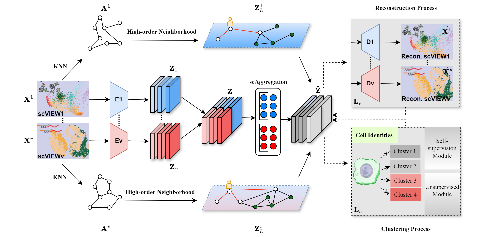

# scMFC: High-order Topology for Deep Single-cell Multi-view Fuzzy Clustering

[](https://www.python.org/)
[](https://pytorch.org/)
[](https://ieeexplore.ieee.org/xpl/RecentIssue.jsp?punumber=91)

## 📖 Overview

**scMFC** is a deep single-cell multi-view fuzzy clustering framework that leverages high-order topology and cross-view information aggregation.

Existing methods often suffer from the underutilization of neighborhood information and information discrepancies between views. **scMFC** addresses these challenges through three integrated modules:

1.  **High-order Topology Enhancement:** Constructs 1-order neighborhood relationships and employs random walks (Node2vec) to generate high-order enhancements for each cell view.
2.  **Cross-view Information Aggregation:** Utilizes a global structure relationship aggregator to dynamically allocate embedding weights, effectively fusing information across different views.
3.  **Deep Fuzzy Clustering:** employs a deep fully connected network to estimate cluster assignments, trained by minimizing a combination of reconstruction loss and clustering loss.

Experiments on three real-world single-cell multi-view datasets demonstrate the stability and superiority of our method.

### Model Framework


> **Paper:** This work is published in *IEEE Transactions on Fuzzy Systems (IEEE TFS)*.

---

## 🛠 Requirements

Please ensure your environment meets the following dependencies:

* **Python** == 3.7.0
* **Torch** == 1.13.1
* **NumPy** == 1.21.6
* **Pandas** == 1.1.5
* **SciPy** == 1.7.3
* **Scikit-learn** == 0.22.2

### External Dependencies
This project utilizes **Node2vec** for graph embedding. Please refer to the official implementation:
* [Node2vec GitHub Repository](https://github.com/aditya-grover/node2vec)

### Installation
You can install the Python dependencies using pip:

```bash
pip install torch==1.13.1 numpy==1.21.6 pandas==1.1.5 scipy==1.7.3 scikit-learn==0.22.2
````

-----

## 📂 Data Availability

Please refer to the `data/` directory for dataset organization. The framework supports standard single-cell multi-view datasets.

**Directory Structure Example:**

```text
data/
├── BMNC/
│   ├── ... (dataset files)
└── [Other_Datasets]/
```

-----

## 🚀 Usage

### 1\. Configuration

The model parameters, such as the target dataset and batch size, can be configured via command-line arguments in `run_scMFC.py`.

```python
# Example arguments
parser = argparse.ArgumentParser(description='Train scMFC model')
parser.add_argument('--dataset', default='BMNC', type=str, required=False, help='Dataset to use (default: BMNC)')
parser.add_argument('--batch_size', default=2048, type=int, help='Batch size for training')
# ... additional arguments ...
```

### 2\. Execution

To train the model and perform clustering, simply run:

```bash
python run_scMFC.py
```

-----
## 📧 Contact

If you have any questions about the code or the paper, please feel free to contact:

**Dayu Hu**
Email: [hudy@bmie.neu.edu.cn](mailto:hudy@bmie.neu.edu.cn)

-----

## 📝 Citation

If you find **scMFC** useful for your research, please consider citing our paper:

**Text:**

> Hu, D., Dong, Z., Liang, K., Yu, H., Wang, S., & Liu, X. (2024). High-order Topology for Deep Single-cell Multi-view Fuzzy Clustering. *IEEE Transactions on Fuzzy Systems*.

**BibTeX:**

```bibtex
@article{scMFC,
  title={High-order Topology for Deep Single-cell Multi-view Fuzzy Clustering},
  author={Hu, Dayu and Dong, Zhibin and Liang, Ke and Yu, Hao and Wang, Siwei and Liu, Xinwang},
  journal={IEEE Transactions on Fuzzy Systems},
  year={2024},
  publisher={IEEE}
}
```

```
```
